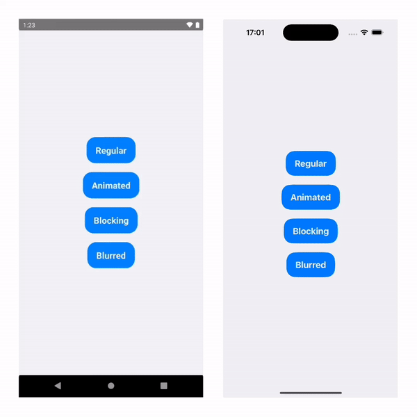
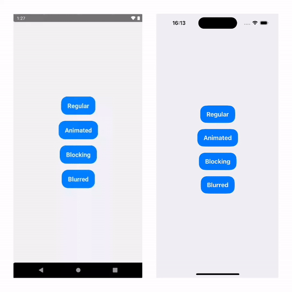
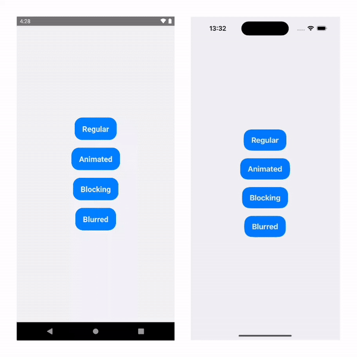

# Example App for React Native Multiple Modals

## Setup

1. Install Node Modules `yarn install`
1. Install CocoaPods `pod install --project-directory=ios`
1. Run the app:
   1. Android: `yarn android`
   1. iOS: `yarn ios`

## Examples inside

### **RegularModal**

The most simple use case.

### **AnimatedModal**

Same as regular, but with custom entering and exiting animations.

### **BlockingModal**

Different animation. Cannot be closed by tapping outside or android back button.

### **BlurredModal**

Same as blocking modal, but backdrop uses blur component

### **GesturedModal**

Same as regular, but supports gestures & reanimations inside
